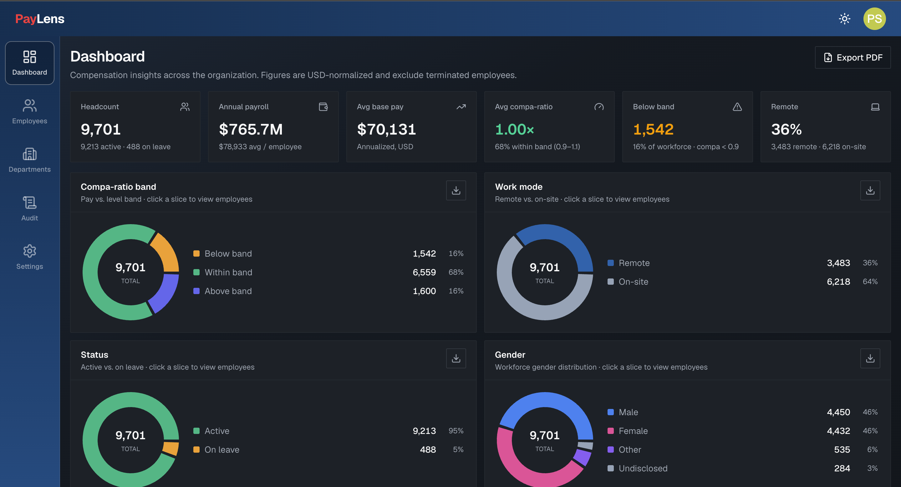

# PayLens

**Employee salary management + compensation insights** for HR, built for an organization of **~10,000 employees across multiple countries and currencies**.

PayLens replaces error-prone, spreadsheet-based salary tracking with a web app that lets HR **manage** compensation data and **answer "how do we pay people?"** — correctly normalized across currencies and pay frequencies.

**Live demo → [paylens-taupe.vercel.app](https://paylens-taupe.vercel.app)**

> Design docs: [`docs/requirements.md`](docs/requirements.md) · [`docs/architecture.md`](docs/architecture.md) · [`docs/decisions.md`](docs/decisions.md)

## Demo login

No public sign-up — users are provisioned (login-only, appropriate for sensitive salary data). All demo accounts share the password **`Password123!`**.

| Email | Role | Access |
|-------|------|--------|
| `hr@acme.com` | HR Manager | Full — view + edit compensation |
| `viewer@acme.com` | Viewer | Read-only |

(`hr2@acme.com` / `hr3@acme.com` are additional HR Managers.)

## Screenshots




## Features

| # | Feature | Notes |
|---|---------|-------|
| F1 | **Employee directory** | Server-side paginated, searchable, and filterable table over 10k rows; typeahead search, multi-dimension filters, currency toggle, CSV export |
| F2 | **CRUD + validation** | Create employees and record compensation changes, validated with shared Zod schemas; optimistic-concurrency protection on salary edits |
| F3 | **Audit trail** | Append-only log of compensation changes (before/after), viewable in the Audit view |
| F4 | **Multi-currency normalization** | Native currency + amount stored as `DECIMAL`, plus a USD-equivalent via a stored FX snapshot; aggregates only ever use normalized USD |
| F5 | **Analytics dashboard** | Headcount, total/average comp, pay by **country / department / level**, min · median · p90 · max, and distribution charts — all currency-normalized. Exportable to PDF |
| F6 | **10k-employee seed** | Realistic employees across countries, currencies, departments, and levels for a true-to-scale demo |

Plus: role-based access (HR Manager vs read-only Viewer), light/dark theme, and a DOM-accurate PDF export of the dashboard.

## Tech stack

| Layer | Choice |
|-------|--------|
| Framework | **Next.js** (App Router) + **TypeScript**, Server Actions |
| UI | **Tailwind CSS** + **shadcn/ui** + Recharts |
| Data grid | **TanStack Table** (server-driven pagination/sort/filter) |
| Database | **PostgreSQL** (`DECIMAL` money, SQL aggregation) |
| ORM | **Prisma** (type-safe queries, migrations, seeding) |
| Validation | **Zod** (shared, testable schemas) |
| Auth | Custom cookie sessions (**argon2** password hashing, `httpOnly` cookies, RBAC) |
| Tests | **Vitest** (pure logic layer) |
| Deploy | **Vercel** + **Neon Postgres** (`docker-compose` for local Postgres) |

See [`docs/architecture.md`](docs/architecture.md) for the layered design, data model (8 tables), and the three "smart" normalization columns that make cross-currency analytics correct.

## Getting started (local)

Prerequisites: **Node 20+** and **Docker** (for local Postgres).

```bash
# 1. Install dependencies
npm install

# 2. Start Postgres
docker compose up -d

# 3. Configure env
cp .env.example .env

# 4. Apply migrations + generate the client
npm run db:migrate

# 5. Seed reference data + 10k employees + demo users
npm run seed

# 6. Run the app
npm run dev
```

App runs at http://localhost:3000. Sign in with the [demo credentials](#demo-login) above.

## Environment variables

| Variable | Purpose |
|----------|---------|
| `DATABASE_URL` | Postgres connection (pooled). Matches `docker-compose.yml` locally |
| `DATABASE_URL_UNPOOLED` | Direct (non-pooled) connection used by Prisma migrations. Same as `DATABASE_URL` locally; the unpooled endpoint on Neon |
| `SEED_DEMO_PASSWORD` | Optional — password for seeded demo accounts (defaults to `Password123!`) |

See [`.env.example`](.env.example).

## Scripts

| Script | Purpose |
|--------|---------|
| `npm run dev` | Start the dev server |
| `npm run build` | Production build (`prisma migrate deploy && next build`) |
| `npm run seed` | Seed reference data, employees, and demo users |
| `npm test` | Run the unit test suite |
| `npm run db:migrate` | Create/apply Prisma migrations |
| `npm run db:reset` | Drop, re-migrate, and re-seed the database |
| `npm run db:generate` | Generate the Prisma client |
| `npm run db:studio` | Open Prisma Studio |

## Testing

Fast, deterministic **Vitest** unit tests concentrate on the correctness-critical logic layer — currency/frequency normalization, percentile/median/mean math, salary validation, CSV/date/search-param utilities — with no DB dependency.

```bash
npm test
```

## Project structure

```
prisma/            Schema, migrations, and seed scripts (reference data + 10k employees)
src/app/           App Router routes (auth, dashboard, employees, departments, audit, settings)
src/components/    UI: layout chrome, analytics cards/charts, employee table + filters
src/lib/           Pure business logic (money, stats, pay-breakdown, validation) + data access
docs/              Requirements, architecture, and decision records
```
