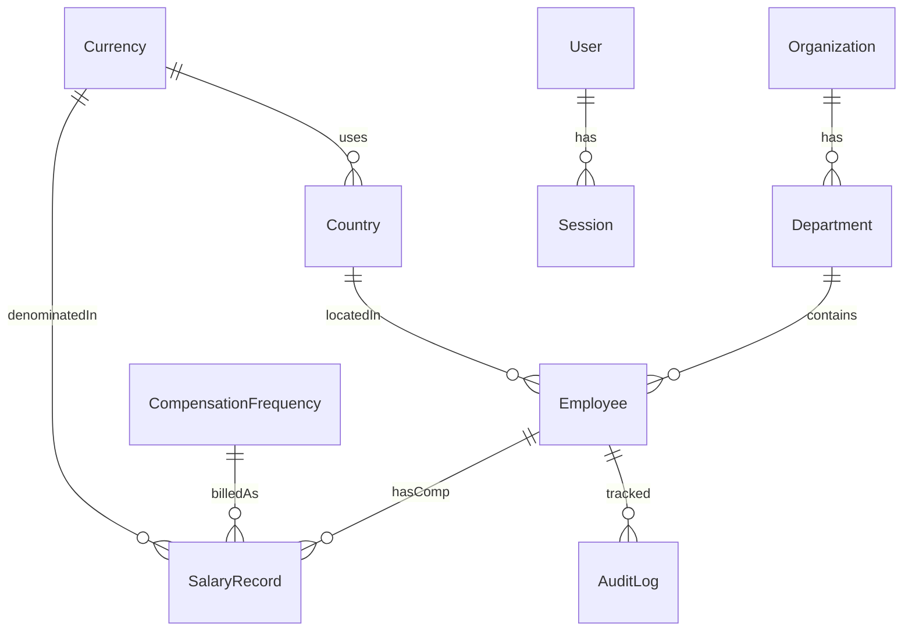

# PayLens — Architecture & Design Notes

Describes *what* the system is and *how* it is structured. For *why* each choice was made and which alternatives were rejected, see [`decisions.md`](decisions.md).

## 1. Tech Stack

| Layer | Choice | Role |
|-------|--------|------|
| Framework | **Next.js (App Router) + TypeScript** | UI + server in one codebase; Server Actions as the server seam |
| UI | **Tailwind CSS + shadcn/ui** | Accessible, data-dense HR screens |
| Data grid | **TanStack Table (server-driven)** | Pagination/sort/filter pushed to the DB for 10k rows |
| Charts | **Recharts** | Analytics visualizations |
| Database | **PostgreSQL** | Relational integrity, `DECIMAL` money, SQL aggregation |
| ORM | **Prisma** | Type-safe queries, migrations, seeding; typed `groupBy`/`aggregate` for analytics |
| Validation | **Zod** | Shared, testable validation at the server boundary |
| Auth | **Custom credential auth** | argon2 hashing; DB-backed sessions via an `HttpOnly` + `Secure` + `SameSite=Lax` cookie (idle + absolute timeouts); `HR_MANAGER` / `VIEWER` RBAC |
| Tests | **Vitest** | Fast, deterministic unit tests of the logic layer |
| Deploy | **Vercel + Neon Postgres** | Deployed URL; `docker-compose` for local Postgres |

## 2. Layered Architecture

```
┌───────────────────────────────────────────────┐
│  UI (React Server + Client Components, shadcn) │  pages, tables, charts, forms
├───────────────────────────────────────────────┤
│  Server Actions / Route Handlers               │  thin: parse + authorize + delegate
├───────────────────────────────────────────────┤
│  Business Logic (pure TS, unit-tested)         │  currency + frequency normalization, statistics, validation
├───────────────────────────────────────────────┤
│  Data Access (Prisma)                          │  queries, pagination, aggregation
├───────────────────────────────────────────────┤
│  PostgreSQL                                    │  reference data, employees, salaries, audit, users
└───────────────────────────────────────────────┘
```

**Key principle:** the business-logic layer is **pure and deterministic** (no I/O), so it is unit-tested in isolation. The UI never touches the DB directly; only Server Actions do, via Prisma.

## 3. Data Model (10 tables)



- **Organization** — single row; `name`, `baseCurrency` (USD).
- **Currency** — `code` (PK), `symbol`, `rateToUsd` DECIMAL. The stored FX snapshot.
- **Country** — `iso2` (PK), `name`, `currencyCode` -> Currency.
- **Department** — `id`, `name`. Lightweight pay-by-department dimension.
- **CompensationFrequency** — `id`, `label`, `annualFactor` (annual=1, monthly=12, hourly=2080).
- **Employee** — identity, `email`, `employeeNumber`, `title`, `hireDate`, `dob`, `gender`, `level`, `status`, `isRemote`, `countryIso2` -> Country, `departmentId` -> Department.
- **SalaryRecord** — `basePay` DECIMAL(16,2), `totalComp` DECIMAL(16,2), `currencyCode`, `frequencyId`, `basePayUsd`, `annualizedUsd`, `annualizedTotalUsd`, `compaRatio`, `effectiveDate`, `isCurrent`, `version` (optimistic concurrency). History preserved via non-current records.
- **AuditLog** — `employeeId`, `action`, `entity`, `before` JSONB, `after` JSONB, `changedBy`, `createdAt`. Append-only.
- **User** — `email`, `passwordHash`, `name`, `role` (`HR_MANAGER` | `VIEWER`).
- **Session** — opaque crypto-random `id` (the cookie value), `userId` -> User, `expiresAt` (absolute timeout), `lastActiveAt` (idle timeout). Server-side, so sessions are revocable.

### The four denormalized-on-write columns
1. **`Currency.rateToUsd`** — FX snapshot (deterministic, testable).
2. **`SalaryRecord.basePayUsd`** — computed on write via `toUsd(basePay, currency)`; avoids per-query FX joins.
3. **`SalaryRecord.annualizedUsd`** / **`annualizedTotalUsd`** — `…Usd x annualFactor` for base and total comp; the canonical values all cross-employee analytics compare on (solves currency *and* frequency mismatch).
4. **`SalaryRecord.compaRatio`** — `annualizedUsd / level+country band midpoint`; precomputed so band-position filtering/sorting is a single indexed lookup.

### Money & currency rules
- All amounts stored as `DECIMAL` in the salary's native currency.
- Cross-country aggregates only ever use the normalized (`annualizedUsd`) value — never raw amounts across currencies.

## 4. Performance Considerations (10k employees)

- **Server-side pagination** — fetch only the visible page; never ship 10k rows to the browser.
- **Indexes** on `countryIso2`, `departmentId`, `level`, and search columns (name/email/employeeNumber).
- **Aggregation** — coarse metrics (counts, sums, averages, group-bys) run DB-side via Prisma `groupBy`/`aggregate` over the denormalized USD columns. Percentile/median pay breakdowns run DB-side too: a single `$queryRaw` uses `percentile_cont(0.5/0.9)` with `GROUP BY GROUPING SETS` to summarize by country, department and level in one pass, so Postgres returns a few dozen summary rows instead of shipping ~10k rows to the app. Only label resolution + ordering happens in a pure, unit-tested module (`shapePayBreakdowns`); `stats.ts` keeps the equivalent interpolation math as a tested reference.
- 10k rows is small for Postgres; the discipline is in the UI/query patterns, not raw scale.

## 5. Testing Strategy

- **Unit tests (Vitest)** on the pure logic layer: currency + frequency normalization, percentile/median/avg math, salary validation, distribution bucketing.
- Tests are **fast** (no DB), **deterministic** (fixed FX snapshot + fixtures), and **readable** (arrange/act/assert).
- Coverage concentrates on the correctness-critical parts — the money math and statistics.
